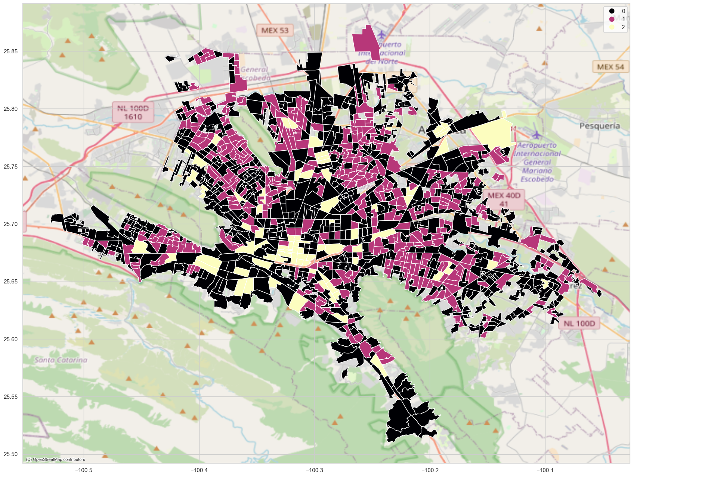
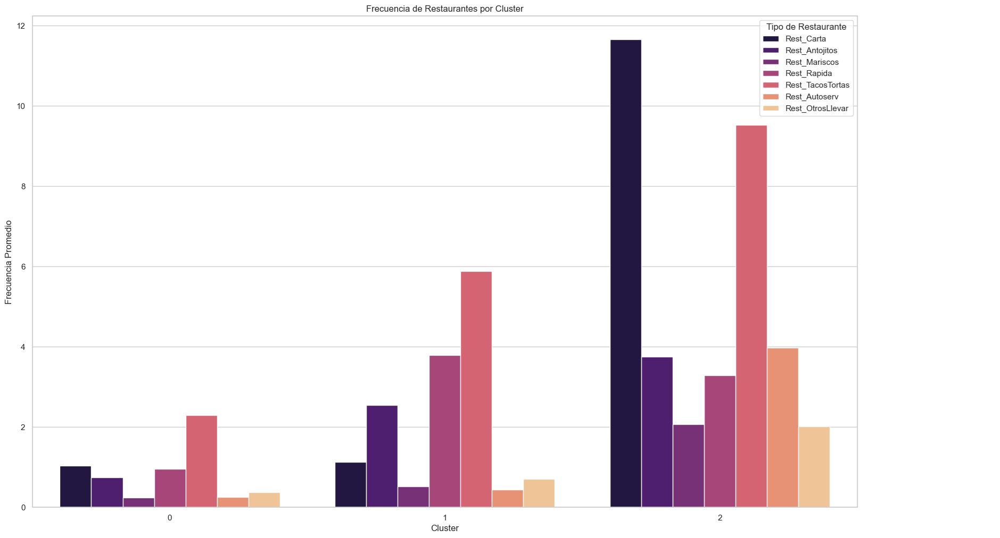

# Optimal Business Location Prediction Using INEGI Data

This project focuses on predicting optimal physical business locations in Mexico using large-scale data from INEGI, including census and business directories. By leveraging unsupervised learning and clustering algorithms, the relationship between restaurant density and population distribution is analyzed to identify the best geographic areas to establish a new business.

## Objectives
- **Business Understanding**: Identify high-potential business locations using demographic and economic data.
- **Data Understanding**: Use data from INEGI’s National Statistical Directory of Economic Units (DENUE) and Population Census to analyze variables like population and business frequency.
- **Data Preparation**: Clean and filter over 186,000 business records and census data for the Monterrey Metropolitan Area.
- **Modeling**: Implement clustering algorithms (K-Means, DBSCAN, Gaussian Mixture, etc.) to segment the region into areas of high and low business potential.
- **Evaluation**: Analyze the quality of clusters based on silhouette score, Davies-Bouldin index, and inertia to select the optimal model.
- **Deployment**: Visualize the clusters on an interactive map using Streamlit.

## Data Sources
- **DENUE**: Provides business-related data, including location and type of business.
- **Population Census**: Demographic data at the neighborhood level (AGEB) for Nuevo León.

## Clustering Models Used
1. **K-Means**: Identified 3 clusters, with clear segmentation of high and low business potential areas.
2. **DBSCAN**: Detected dense business areas without requiring a predefined number of clusters.
3. **Gaussian Mixture Model**: Grouped data based on probabilistic distribution, offering insight into population-business relationships.
4. **Hierarchical Clustering**: Built a hierarchy of clusters, providing a tree-like structure for better visualization of nested clusters.
5. **Mean Shift**: Identified regions of high data density, but struggled with noisy data in sparse areas.
6. **Self-Organizing Maps (SOM)**: Used neural networks to create a low-dimensional representation of the data, visualizing clusters effectively.

## Key Results
- **K-Means**: Selected as the best model for predicting business location due to its ability to minimize intra-cluster variance.

*Figure 1: Map of Monterrey divided into clusters using the K-means model.*
  
- **Cluster Insights**:
  - **Cluster 0**: High density, optimal for diverse business types.
  - **Cluster 1**: Low density, potential for new business establishment.
  - **Cluster 2**: Moderate density, balanced commercial and residential areas.

*Figure 2: Frequency of restaurant types by cluster in Monterrey.*

## Conclusion
This project demonstrates the potential of using clustering models to predict optimal business locations in Mexico. By integrating data from INEGI, the model helps identify areas with unsaturated markets, providing actionable insights for business owners and entrepreneurs.

## Future Work
- Extend the model to other regions in Mexico.
- Include more business sectors beyond restaurants.
- Refine the clustering models with additional socio-economic variables.
